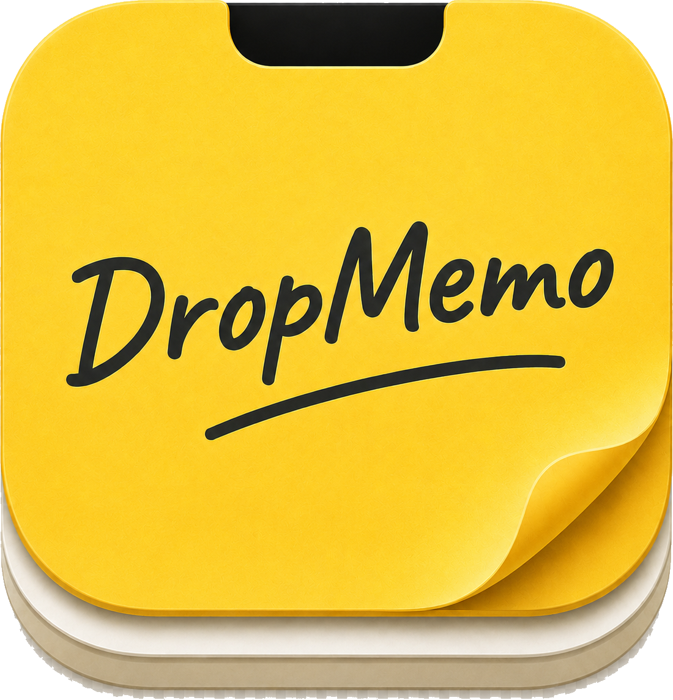
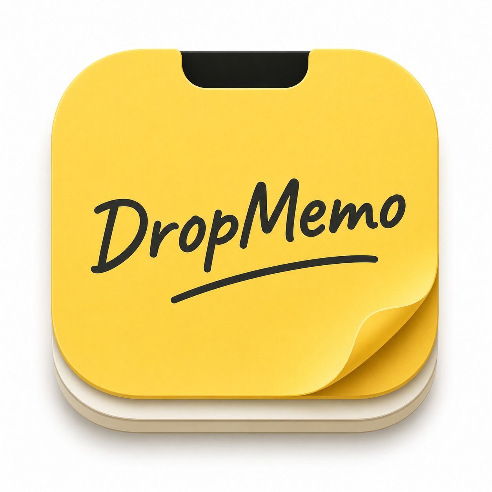

<div align="center">
  
  <h1>DropMemo</h1>
  <p><strong>悬停刘海，即刻记录</strong></p>
  <p>一款为 MacBook 刘海屏打造的极简便签工具</p>

  <br>

  
  
  
  
</div>

---

## ✨ 什么是 DropMemo？

DropMemo 是一款运行在 macOS 菜单栏的轻量级便签工具。**只需将鼠标悬停到 MacBook 的刘海区域**，便签面板就会从顶部优雅滑出，随手记录灵感、待办和笔记。鼠标移开后面板自动收起，**零桌面空间占用，零工作流打断**。

<div align="center">
  
</div>

---

## 🚀 核心功能

| 功能 | 说明 |
|:---|:---|
| 🖱️ **刘海触发** | 鼠标悬停刘海区域即刻唤出面板，无需点击、无需快捷键 |
| 📑 **多标签管理** | 最多 20 个标签页，双击重命名，每个标签独立主题色 |
| ✏️ **富文本编辑** | 加粗、斜体、删除线、字体颜色、待办清单、有序/无序列表 |
| 🎨 **三套主题** | 深夜黑、纸质白、便签黄 — 每个标签可独立选择 |
| 📌 **置顶锁定** | 一键锁定面板，编辑时不会自动收起 |
| ☁️ **iCloud 同步** | 通过 iCloud Drive 自动同步，多台 Mac 无缝切换 |
| 📤 **Markdown 导出** | 一键导出为 `.md` 文件，数据永远属于你 |
| 🚀 **开机自启** | 默认开机启动，随时待命 |

---

## 📦 安装

### 方式一：下载 DMG 安装包

前往 [Releases](https://github.com/cjoannnnn-netizen/DropMemo/releases) 页面下载最新版本的 `.dmg` 文件，双击打开后将 DropMemo 拖入「应用程序」文件夹即可。

### 方式二：从源码构建

```bash
# 克隆仓库
git clone https://github.com/cjoannnnn-netizen/DropMemo.git
cd DropMemo

# 安装依赖
npm install

# 开发模式运行
npm run dev

# 打包为 DMG
npm run package
```

---

## 🛠️ 技术栈

| 技术 | 用途 |
|:---|:---|
| **Electron 33** | 桌面应用框架 |
| **React 18** + **TypeScript** | 前端 UI |
| **Tiptap 2.x** | 富文本编辑器 |
| **Vite 6** | 构建工具 |
| **Vanilla CSS** + CSS Variables | 主题系统 |
| **electron-builder** | 打包为 macOS DMG |

---

## 📁 项目结构

```
DropMemo/
├── electron/
│   ├── main.js          # Electron 主进程（窗口管理、鼠标追踪、IPC）
│   └── preload.js       # 预加载脚本（安全桥接）
├── src/
│   ├── App.tsx           # 主应用组件
│   ├── App.css           # 全局样式 + 主题变量
│   └── components/
│       ├── TabBar.tsx     # 标签栏 + 置顶按钮
│       ├── NoteEditor.tsx # Tiptap 编辑器
│       ├── Toolbar.tsx    # 工具栏
│       ├── ColorPicker.tsx# 字体颜色选择器
│       ├── ThemePicker.tsx# 主题切换器
│       ├── Settings.tsx   # 设置面板
│       └── StatusBar.tsx  # 底部状态栏
├── logo.png              # 应用图标
├── package.json
└── vite.config.ts
```

---

## 💡 使用提示

- **唤出面板**：将鼠标移到屏幕顶部中央的刘海区域，稍等片刻面板即会滑出
- **收起面板**：将鼠标移出面板区域，面板会自动收起
- **锁定面板**：点击标签栏右侧的 🔒 图标，面板将保持常驻
- **新建标签**：点击标签栏的 `+` 按钮
- **重命名标签**：双击标签名称即可编辑
- **切换主题**：点击工具栏的设置按钮，选择「背景主题」
- **导出笔记**：工具栏 → 导出为 Markdown

---

## 🤝 参与贡献

欢迎提交 Issue 和 Pull Request！

1. Fork 本仓库
2. 创建功能分支 (`git checkout -b feature/amazing-feature`)
3. 提交更改 (`git commit -m 'Add amazing feature'`)
4. 推送分支 (`git push origin feature/amazing-feature`)
5. 提交 Pull Request

---

## 📄 许可证

本项目采用 [MIT License](LICENSE) 开源协议。

---

<div align="center">
  <sub>Made with ❤️ for MacBook users</sub>
</div>
